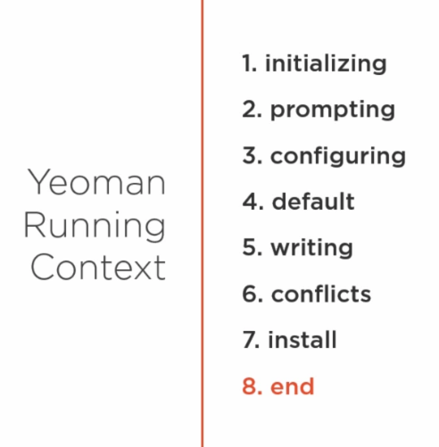

# yeoman_basics

Creating your own generator

<ul>
    <li>npm init</li>
    <li>following instructions to create package</li>
    <li>having index.js declare a generator</li>
    <li>npm link</li>
    <li>now you can go into another directory and do &gt yo yang</li>  
</ul>
 
Here are some notes in the yeoman context 

